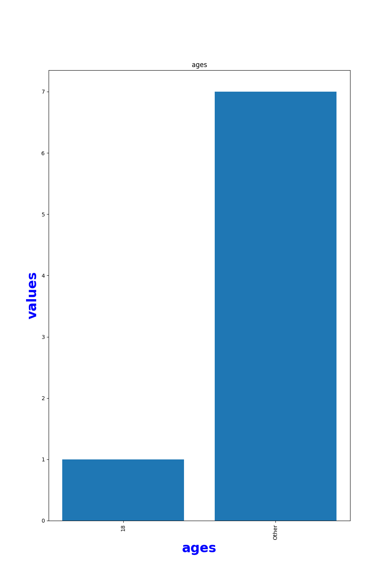
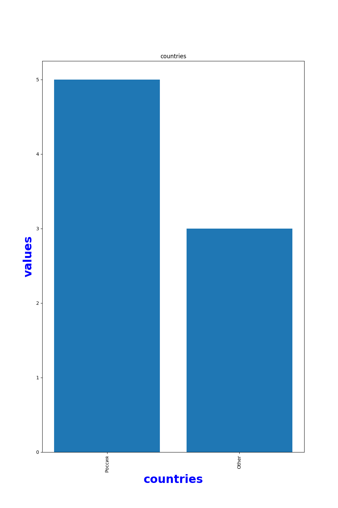

# VK Likes Analisy
## Стек технологий
* **FastAPI**
* **Jinja2**
* **API VK**
* **MatPlotLib**
* **Docker**
* **docker-compose**

## Описание
Web-сервис, предназначенный для анализа пользователей, отреагировавших на пост VK. В качестве Web-фреймворка используется **FastAPI**. Взаимодействие с фронтом осуществляется с помощью встроенного в **FastAPI** модуля **Jinja2**.

## Принцип работы программы
По адресу `localhost:8000/` открывается страница с формой, состоящей из: 
- поля, в которое нужно вставить ссылку на пост в формате `https://vk.com/[group_name|feed]?w=wall-[group_id]_[post_id]`
- чекбоксов с категориями, по которым нужно проанализировать данные пользователей, а именно:
  - Пол
  - Возраст
  - Город
  - Страна

Нажимая на кнопку *Submit*, программа отправляет запросы к *api.vk.com*, фильтрует и группирует данные (пример конечных данных находится в файле `example.json`), из которых в дальнейшем формирует столбчатые диаграммы, с помощью `MatPlotLib`.

## Пошаговая сборка запуск проекта
  * Получить **vk access token** по <a href="https://vkhost.github.io/">этой ссылке</a>, выбрав *VK Admin*
  * Создать виртуальное окружение
  * В командной строке прописать `pip install -r requirements.txt`
  * Создать файл .env, в котором прописать следующие переменные:
    * `ACCESS_TOKEN`
    * `MEDIA_FILEPATH`
  * Запустить *Uvicorn* командой `uvicorn backend.main:app --reload`
  * Перейти по адресу `localhost:8000/` и вставить в форму ссылку на пост

## Результат работы программы

